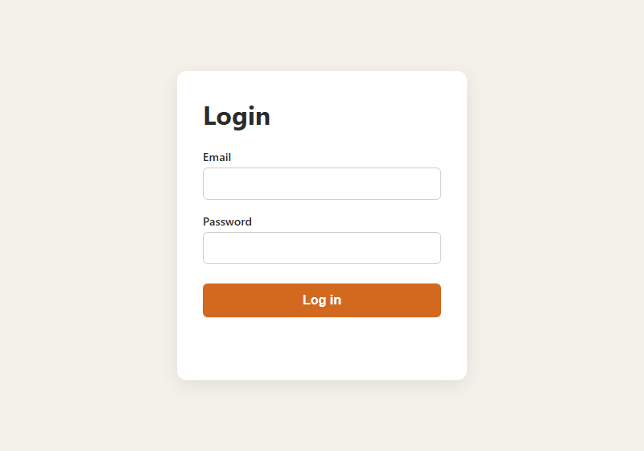
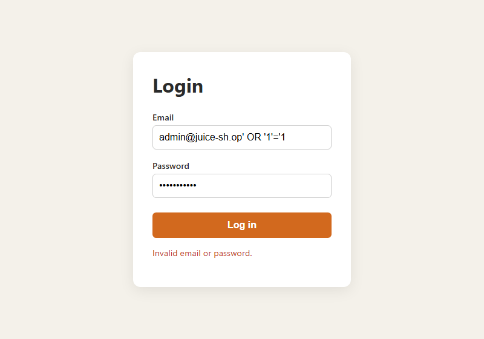

# CSCE 477 Homework 2B

**Repository:** https://github.com/cmangalwedhe/csce-477-hw2

## Part 1: Secure Feature Design

I spent some time going through the Juice Shop demo and found three things worth writing up. The first is the login page. If you type `' OR 1=1--` into the email box with any password, it logs you straight in as the admin, because the app drops your input directly into the SQL string. The second is the search bar, which echoes your search term back onto the page without cleaning it, so `<iframe src="javascript:alert(1)">` actually runs. The third is weak login protection: there is no limit on password attempts, so an account can be brute forced. To stop these I would use parameterized queries so input is only ever data, encode anything printed back to the page and add a Content-Security-Policy header, and hash passwords with bcrypt while limiting login attempts.

Secure password handling:

```js
const bcrypt = require("bcryptjs");
// On registration, store only the salted hash (cost factor 12):
const hash = bcrypt.hashSync(plaintextPassword, 12);
// On login, compare without ever storing or logging plaintext:
const ok = bcrypt.compareSync(submittedPassword, hash);
```

## Part 2: Front-End Form

For the form I made a login page with email and password fields, styled to look a bit like Juice Shop's (`public/index.html` and `app.js`). The JavaScript checks that neither field is empty, that the email contains an `@`, and that the password is at least 8 characters before it sends anything. I did not want to rely on that alone, since anyone can skip the browser and hit the server directly, so the Node/Express backend (`server.js`) runs the same checks again. Passwords are stored as bcrypt hashes, the database lookup uses a parameterized query, every failed login returns the same message so you cannot tell which accounts exist, and there is a limit of 10 attempts per 15 minutes. You run it with `npm install` and then `npm start`, then open `http://localhost:3000`.



## Part 3: Exploiting My Own Form

Then I tried to break my own form. I used the classic `admin@juice-sh.op' OR '1'='1` in the email box, also a plain `' OR 1=1--`, and an XSS attempt `<script>alert(1)</script>@x`, testing each one both in the browser and with curl. None of them worked. Every attempt came back with "Invalid email or password," no login and no popup. The injection fails because the query treats my input as a plain string that does not match any user, and the status text is set with `textContent`, so the script tag just shows up as literal text instead of running. To make sure it was not luck, I wrote a small script using the old string-building style of query, and there the exact same payload logged in and returned the admin row. So the thing that actually protected me was using parameterized queries. If the form had been built the naive way, switching to prepared statements is the fix.



Test output:

```
=== SQL injection auth-bypass attempt ===
{"success":false,"message":"Email must contain '@'."}
=== injection with valid-looking email ('admin@juice-sh.op' OR '1'='1) ===
{"success":false,"message":"Invalid email or password."}
=== XSS payload in email field ===
{"success":false,"message":"Invalid email or password."}
=== correct credentials ===
{"success":true,"message":"Login successful."}

=== vulnerable-demo.js (concatenated SQL, same payload) ===
Executed query: SELECT * FROM users WHERE email = 'admin@juice-sh.op' OR '1'='1'
Leaked row: { id: 1, email: 'admin@juice-sh.op', password_hash: 'real-hash' }
Rows returned: 1  ->  AUTH BYPASS SUCCEEDED
Parameterized version with same payload -> matched NO rows (injection neutralized).
```
