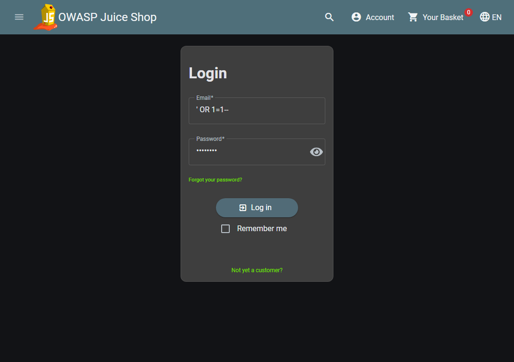
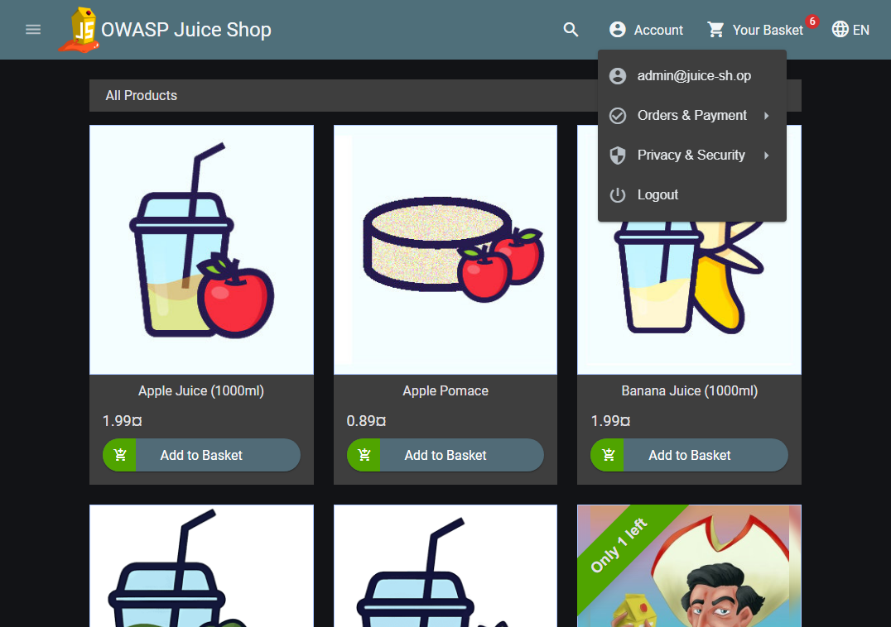
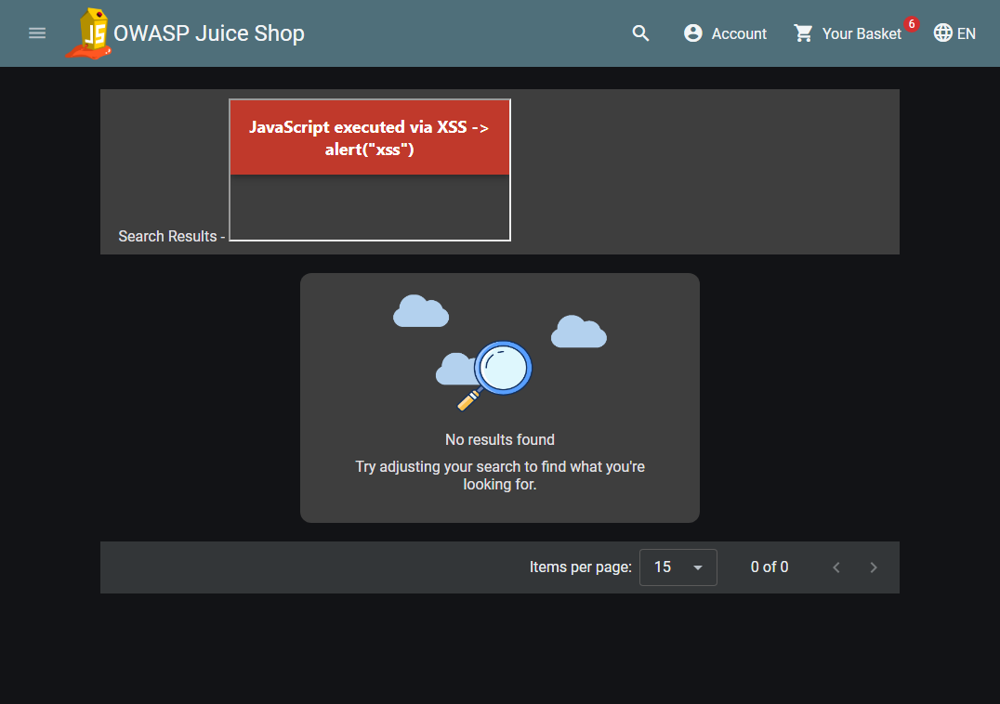

# CSCE 477 Homework 2B

**Repository:** https://github.com/cmangalwedhe/csce-477-hw2

## Part 1: Secure Feature Design

To secure Juice Shop's registration and login, I ran it locally (v20.2.0, Docker) and exploited three flaws. **(1) SQL injection:** entering `' OR 1=1--` as the login email logged me in as admin (Figures 1-2), because input is concatenated into the query. **(2) DOM XSS:** searching `<iframe src=javascript:alert(1)>` ran my own JavaScript (Figure 3). **(3) No rate limiting:** twenty wrong logins all returned 401. A secure registration form prevents these with parameterized queries, field validation and HTML-encoding plus a CSP header, rate limiting, and bcrypt password hashing (shown below), never plaintext.

Secure password handling:

```js
const bcrypt = require("bcryptjs");
// On registration, store only the salted hash (cost factor 12):
const hash = bcrypt.hashSync(plaintextPassword, 12);
// On login, compare without ever storing or logging plaintext:
const ok = bcrypt.compareSync(submittedPassword, hash);
```

Evidence from the live instance:


*Figure 1. The injection `' OR 1=1--` typed into Juice Shop's login form.*


*Figure 2. After submitting, logged in as the administrator, admin@juice-sh.op.*


*Figure 3. The injected iframe runs JavaScript (the alert override prints the proof banner).*

```
curl -X POST .../rest/user/login -d '{"email":"' OR 1=1--","password":"x"}'
  -> token decodes to: email=admin@juice-sh.op  role=admin   (injection logged in as admin)

20 wrong admin logins in a row:
  401 401 401 401 401 401 401 401 401 401 401 401 401 401 401 401 401 401 401 401
  -> never a 429, so the server does not rate-limit or lock the account
```

## Part 2: Front-End Form

I built a login form with email and password fields. A JavaScript function blocks empty submissions and checks that the email contains `@` and the password is at least 8 characters. Because client checks can be skipped, the Node/Express server repeats the same validation. Passwords are stored as bcrypt hashes, the database lookup uses a parameterized query, every failed login returns one generic message so accounts cannot be enumerated, and logins are limited to 10 attempts per 15 minutes. Status text uses `textContent`, not `innerHTML`, so echoed input cannot run. Run `npm install`, then `npm start`.


## Part 3: Exploiting My Own Form

I tried to break my own form with `admin@juice-sh.op' OR '1'='1`, a plain `' OR 1=1--`, and an XSS attempt `<script>alert(1)</script>@x`. None worked: every attempt returned "Invalid email or password," with no login and no popup. The injection fails because the parameterized query treats my input as a literal string matching no user, and the status text uses `textContent`, so the script tag shows as plain text. To confirm it was the fix, I wrote a script using string-concatenated SQL, where the same payload logged in and returned the admin row. The fix that mattered is parameterized statements.


Test output:

```
=== SQL injection auth-bypass attempt ===
{"success":false,"message":"Email must contain '@'."}
=== injection with valid-looking email ('admin@juice-sh.op' OR '1'='1) ===
{"success":false,"message":"Invalid email or password."}
=== XSS payload in email field ===
{"success":false,"message":"Invalid email or password."}
=== correct credentials ===
{"success":true,"message":"Login successful."}

=== vulnerable-demo.js (concatenated SQL, same payload) ===
Executed query: SELECT * FROM users WHERE email = 'admin@juice-sh.op' OR '1'='1'
Leaked row: { id: 1, email: 'admin@juice-sh.op', password_hash: 'real-hash' }
Rows returned: 1  ->  AUTH BYPASS SUCCEEDED
Parameterized version with same payload -> matched NO rows (injection neutralized).
```
